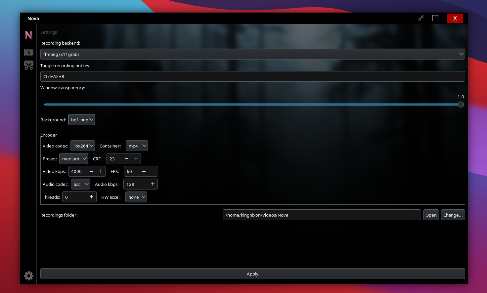
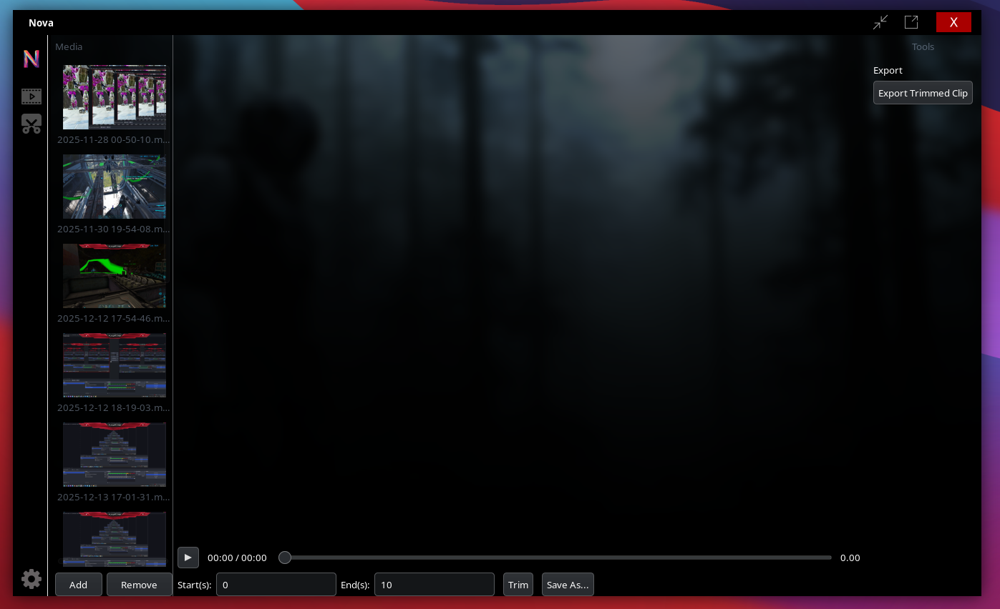
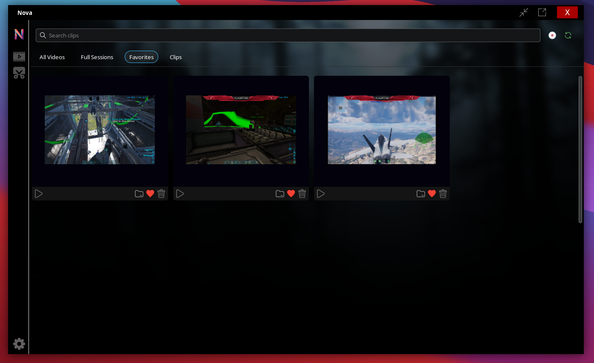

# Nova Replay


<div style="display:flex;gap:12px;flex-wrap:wrap;align-items:flex-start">
	
	
	
</div>

 	  
                          
### Nova Replay is a lightweight, local-first screen clipper for Linux. It's a developer-friendly prototype that focuses on capturing short clips with a polished GTK UI and simple clip management. ###


### Highlights
- Modern GTK3 UI (Python + PyGObject)
- Uses native tools for capture: `ffmpeg` for X11/pipewire, `wf-recorder` for Wayland when available (wayland support is very limited as of right now, but I do plan on adding full wayland support)
- Thumbnail generation and clip management (play, delete, save-as)
- Basic trimming via `ffmpeg` (copy-based trims)
- Packable as an AppImage for distribution

### Requirements 
- Python 3.8+
- System tools: `ffmpeg` (required), `xdg-utils` (for opening folders), optional `mpv` for better playback
- Python deps: see `requirements.txt` (PyGObject, Pillow; `pynput` optional for global hotkeys)

### Quickstart (Linux Arch x86_64 Linux (non Wayland))

Head to Releases and download the latest appimage
Make sure the Nova_Replay-x86_64.AppImage can execute as a program
Then just double click to run!

### Quickstart (development)

1. Install system deps (Debian/Ubuntu example):

```bash
sudo apt update
sudo apt install python3-gi python3-gi-cairo gir1.2-gtk-3.0 ffmpeg xdg-utils mpv
# optional for Wayland recording
sudo apt install wf-recorder 
```

2. Set up a virtualenv and install Python deps:

```bash
python3 -m venv .venv
. .venv/bin/activate
pip install -r requirements.txt
```

3. Run the app:

```bash
python3 main.py
```

Default recordings directory: `~/Videos/Nova` (created automatically). Change this from Settings.

### Packaging (AppImage)

This repo includes `build_appimage.sh` to help build an AppImage using linuxdeploy and appimagetool. Follow the script header for required binaries and usage notes.

### Design notes & limitations
- Global hotkeys are best-effort and may be restricted on some Wayland compositors.
- Recording relies on external capture tools — behavior varies by compositor and installed binaries.
- Trimming is implemented via `ffmpeg -c copy` and is intentionally simple; richer editing can be added later.

### Contributing
- Issues and PRs welcome. For larger features (Wayland hotkey integration, persistent settings migration), open an issue to discuss the approach first.

## Enjoy — and thanks for trying Nova Replay!
